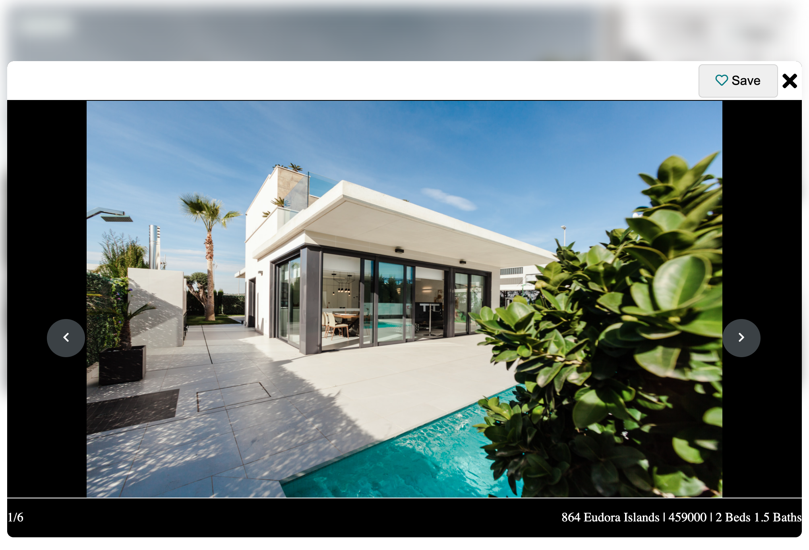
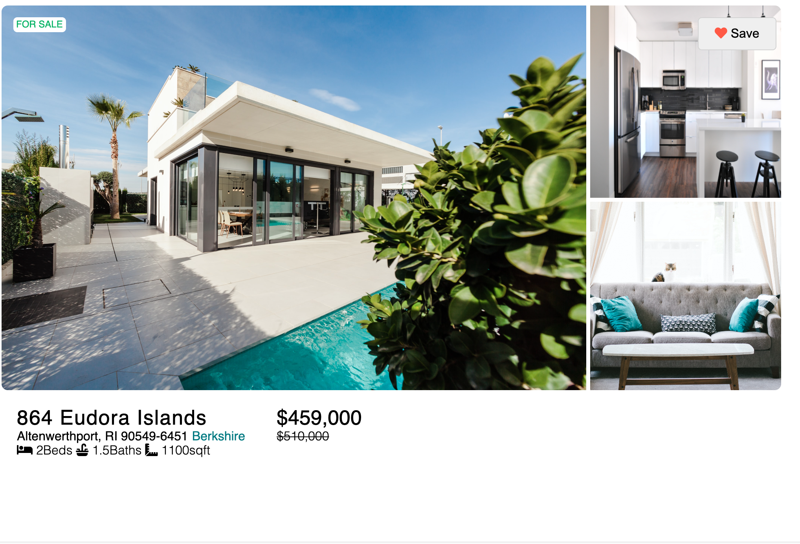
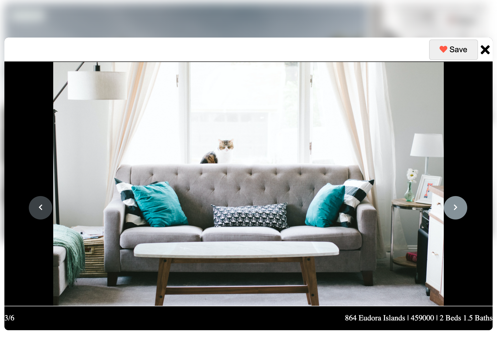

# Relia

## TECH STACK:
  ### MERN MongoDB, Express, React Node.js
    AWS S3 used to store images for each listing
    
## Description:
Photo display component for real estate listing application. To display listing data and fetch photos from AWS S3

Allow users to save a listing. Which is saved on database and displays on the photo gallery modal.

Allows the users to view photos tied a specific listing and presents them on a photo carousel.

